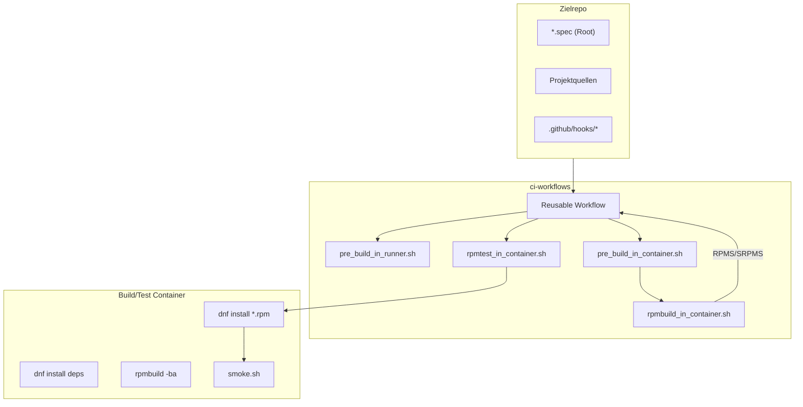

# ci-workflows

Ein zentrales Repository mit wiederverwendbaren GitHub Actions Workflows, Hooks und Container-Skripten zum Bauen und Testen von RPM-Paketen für mehrere Distributionen und Architekturen.

## 🚀 Features

- Multi-Distro (z. B. AlmaLinux, Rocky, Fedora)
- Multi-Arch (x86_64, aarch64, ppc64le, s390x)
- Reproduzierbare RPM-Builds in Containern
- Getrennte Artefakte:
  - Binär-RPMs (`rpm-bin-*`)
  - Source-RPMs (`rpm-src-*`)
- SPEC-Datei im Projekt-Root
- Hook-System für projektbezogene Anpassungen
- Automatische Artefakt-Benennung mit Distro-Suffix
- Smoke-Tests im Container
- Wiederverwendbarer Pulp-Upload-Workflow für Tag-Releases
- Wiederverwendbarer Package-Orchestrierungsworkflow für Build, Test und Upload
- Optionale zentrale Paket-Signierung vor dem Upload

## 📁 Repository-Struktur

```
ci-workflows/
│
├── .github/workflows/
│   ├── build.yml              # Reusable Build/Test Workflow
│   ├── package.yml            # Reusable Package Orchestration Workflow
│   └── pulp-upload.yml        # Reusable Pulp Upload Workflow
│
└── hooks/
├── pre_build_in_runner.sh
├── pre_test_in_runner.sh
├── pre_build_in_container.sh
├── pre_test_in_container.sh
├── rpmbuild_in_container.sh
├── rpmtest_in_container.sh
└── lib/
├── common.sh
├── distro.sh
└── container_images.sh

└── scripts/
  └── pulp-bootstrap.sh
```


## 🧩 Verwendung im Zielrepo

```yaml
jobs:
  package:
    uses: lbetz/ci-workflows/.github/workflows/package.yml@main
    with:
      ci_workflows_ref: "main"
      source_event_name: "workflow_dispatch"
      source_ref_name: "main"
      source_ref_type: "branch"
      run_upload: false
      matrix: |
        el9: x86_64
        debian12: x86_64
        ubuntu24: x86_64
```

Standardverhalten: `sign_packages` ist per Default `true`.
Nur bei Bedarf abschalten mit:

```yaml
sign_packages: false
```

### 🔐 Signierung

Die zentrale Pipeline signiert RPM- und DEB-Pakete standardmaessig vor dem Upload.

Benötigte Secrets im aufrufenden Package-Repo:

- `PACKAGE_SIGNING_PRIVATE_KEY` (ASCII-armored private key)
- `PACKAGE_SIGNING_KEY_ID`
- `PACKAGE_SIGNING_PASSPHRASE`

### 🪝 Projekt-Hooks

```
.github/hooks/
├── pre_build.sh
├── post_build.sh
├── pre_test.sh
├── post_test.sh
└── smoke.sh
```

Alle Hooks sind optional.

### 📦 Artefakte

* rpm-bin-<distro>-<arch> → Binär-RPMs
* rpm-src-<distro>-<arch> → Source-RPMs

Beide werden automatisch korrekt benannt, z.B.:

```
mypkg-1.2.3-1.x86_64.almalinux9.rpm
mypkg-1.2.3-1.src.almalinux9.rpm
```

🧭 **Architekturdiagramm**



### 🧪 Smoke-Tests

Smoke-Tests laufen im Container und können beliebige Kommandos ausführen:

```
.github/hooks/smoke.sh
```

Vorlage:

```bash
#!/usr/bin/env bash
set -euo pipefail

echo "[SMOKE] Running smoke tests..."

# Beispiel: Binary vorhanden?
if ! command -v mybinary >/dev/null; then
  echo "❌ mybinary not found"
  exit 1
fi

# Beispiel: Version check
mybinary --version

# Beispiel: Config check
if [ -f /etc/myapp/config.yml ]; then
  echo "[OK] Config file exists"
else
  echo "❌ Config file missing"
  exit 1
fi

# Beispiel: Service check (falls vorhanden)
if systemctl list-unit-files | grep -q myservice; then
  systemctl status myservice || true
fi

echo "[SMOKE] All tests passed."
```
