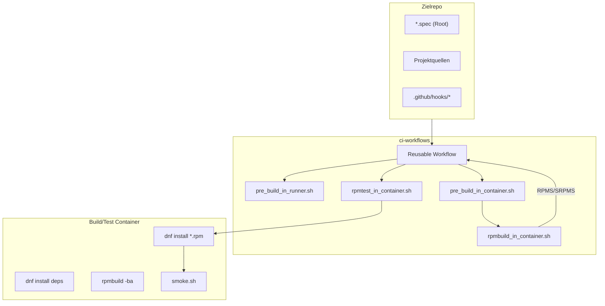

# ci-workflows

Ein zentrales Repository mit wiederverwendbaren GitHub Actions Workflows, Hooks und Container-Skripten zum Bauen, Testen, Signieren und Uploaden von RPM- und DEB-Paketen fuer mehrere Distributionen und Architekturen.

## 🚀 Features

- Multi-Distro (z. B. AlmaLinux, Rocky, Fedora)
- Multi-Arch (x86_64/amd64, aarch64/arm64, ppc64le, s390x)
- Reproduzierbare RPM-Builds in Containern
- Getrennte Artefakte:
  - Binär-RPMs (`rpm-bin-*`)
  - Source-RPMs (`rpm-src-*`)
- SPEC-Datei im Projekt-Root
- Hook-System für projektbezogene Anpassungen
- Automatische Artefakt-Benennung mit Distro-Suffix
- Smoke-Tests im Container
- Wiederverwendbarer Pulp-Upload-Workflow für Tag-Releases
- Wiederverwendbarer Package-Orchestrierungsworkflow für Build, Test und Upload
- Optionale zentrale Paket-Signierung vor dem Upload
- Zentrale Zielaufloesung fuer Uploads ueber TARGET_TYPE, TARGET_FAMILY und TARGET_VERSION

## 📁 Repository-Struktur

```
ci-workflows/
│
├── .github/workflows/
│   ├── build.yml              # Reusable Build/Test Workflow
│   ├── package.yml            # Reusable Package Orchestration Workflow
│   └── pulp-upload.yml        # Reusable Pulp Upload Workflow
│
└── hooks/
├── pre_build_in_runner.sh
├── pre_test_in_runner.sh
├── pre_build_in_container.sh
├── pre_test_in_container.sh
├── rpmbuild_in_container.sh
├── rpmtest_in_container.sh
└── lib/
├── common.sh
├── distro.sh
└── container_images.sh

└── scripts/
  └── pulp-bootstrap.sh
```


## 🧩 Verwendung im Zielrepo

```yaml
jobs:
  package:
    uses: pkging/ci-workflows/.github/workflows/package.yml@main
    with:
      ci_workflows_ref: "main"
      source_event_name: "workflow_dispatch"
      source_ref_name: "main"
      source_ref_type: "branch"
      run_upload: false
      matrix: |
        el9: x86_64
        debian12: x86_64
        ubuntu24: x86_64
```

Mehrere Architekturen pro Distribution werden ebenfalls unterstuetzt:

```yaml
matrix: |
  el9:
    - x86_64
    - aarch64
  ubuntu24: [x86_64, arm64]
```

Alternativ kann `matrix` auch als JSON-Mapping uebergeben werden:

```yaml
matrix: '{"el9": ["x86_64", "aarch64"], "ubuntu24": "x86_64"}'
```

Standardverhalten: `sign_packages` ist per Default `true`.
Nur bei Bedarf abschalten mit:

```yaml
sign_packages: false
```

### Tag-Policy fuer Uploads

Der Reusable-Workflow in [ci-workflows/.github/workflows/package.yml](.github/workflows/package.yml) unterscheidet Uploads nach Tag-Namen:

- `rpm/vX.Y.Z` oder `rpm/vX.Y.Z-suffix`: Upload nur fuer RPM-Ziele (`target_type=rpm`)
- `deb/vX.Y.Z` oder `deb/vX.Y.Z-suffix`: Upload nur fuer APT/DEB-Ziele (`target_type=apt`)
- `vX.Y.Z` oder `vX.Y.Z-suffix` (ohne Prefix): Upload fuer alle Zieltypen in der Matrix

Nicht passende Tags werden abgewiesen (kein Upload).

Beispiele:

- `rpm/v1.0.0-2` -> nur RPM Upload
- `deb/v1.0.0` -> nur DEB/APT Upload
- `v1.0.0-2` -> RPM und DEB/APT Upload

Wichtig fuer aufrufende Repositories: Bei `workflow_call` muss der Event-/Ref-Kontext an den Reusable-Workflow durchgereicht werden, damit Tag-Pushes korrekt ausgewertet werden:

```yaml
with:
  source_event_name: ${{ github.event_name }}
  source_ref_name: ${{ github.ref_name }}
  source_ref_type: ${{ github.ref_type }}
```

### Upload-Zielmodell (zentral)

Die Zielzuordnung fuer Pulp-Uploads wird zentral in `ci-workflows/.github/workflows/package.yml` aus `matrix.distro` berechnet.

Wichtig:

- Aufrufende Repos geben nur `matrix` (Distro/Arch), `run_upload` und optional `sign_packages` an.
- Die bisherigen Inputs `rpm_repository` und `deb_repository` werden nicht mehr verwendet.
- Unbekannte Distros oder ungueltige Zielkombinationen fuehren zu einem sofortigen Hard-Fail.

Aktuelles zentrales Mapping:

| matrix.distro | TARGET_TYPE | TARGET_FAMILY | TARGET_VERSION |
| --- | --- | --- | --- |
| `el8` | `rpm` | `epel` | `8` |
| `el9` | `rpm` | `epel` | `9` |
| `el10` | `rpm` | `epel` | `10` |
| `fedora43` | `rpm` | `fedora` | `43` |
| `fedora44` | `rpm` | `fedora` | `44` |
| `debian11` | `apt` | `debian` | `bullseye` |
| `debian12` | `apt` | `debian` | `bookworm` |
| `debian13` | `apt` | `debian` | `trixie` |
| `ubuntu22` | `apt` | `ubuntu` | `jammy` |
| `ubuntu24` | `apt` | `ubuntu` | `noble` |

Aufloesung im Upload:

- RPM: Repository `rpm-<family>-<version>`, Base-Path `rpm/<family>/<version>`
- APT Debian: Repository `debian-apt`, Base-Path `debian`, Suite ueber `TARGET_VERSION`
- APT Ubuntu: Repository `ubuntu-apt`, Base-Path `ubuntu`, Suite ueber `TARGET_VERSION`

### Self-Hosted Runner Voraussetzungen

Auf einem Self-Hosted Runner werden mehrere Tools und Rechte vorausgesetzt, die auf `ubuntu-latest` bereits vorhanden sind, im pkging aber haeufig fehlen:

- Build und Test benoetigen eine funktionierende Docker-Installation inklusive laufendem Daemon.
- Multi-Arch Builds und Tests (`aarch64` oder `arm64`, `ppc64le`, `s390x`) benoetigen zusaetzlich QEMU bzw. `binfmt_misc`, damit `docker/setup-qemu-action` Container fuer Fremdarchitekturen registrieren kann.
- Die Runner-Hooks und der Signing-Job installieren Pakete per `apt-get`, daher ist der aktuelle Workflow fuer Debian-/Ubuntu-basierte Runner mit `apt-get` ausgelegt.
- Fuer diese Paketinstallation wird `sudo` oder ein Runner mit Root-Rechten benoetigt.
- Der Signing-Job benoetigt ausserdem `gnupg`, `rpm` und fuer DEB-Signaturen `dpkg-sig` oder `debsigs`; der Workflow installiert diese Pakete aktuell selbst.
- Der Upload-Job richtet Python ueber `actions/setup-python` ein und installiert `pulp-cli` per `pip`; dafuer braucht der Runner Netzwerkzugriff auf GitHub/PyPI.

Diese Voraussetzungen werden jetzt vor den eigentlichen Build-, Sign- und Upload-Schritten per Preflight geprueft, damit ein Self-Hosted Runner frueh mit einer klaren Fehlermeldung abbricht.

Fuer Ubuntu/Debian gibt es ausserdem ein Bootstrap-Skript in [scripts/prepare-selfhosted-runner.sh](scripts/prepare-selfhosted-runner.sh), das die ueblichen Host-Voraussetzungen installiert und konfiguriert.

Wenn ein Runner diese Voraussetzungen nicht erfuellt, sollte entweder ein passendes Runner-Label verwendet oder `sign_packages: false` gesetzt werden.

### 🔐 Signierung

Die zentrale Pipeline signiert RPM- und DEB-Pakete standardmaessig vor dem Upload.

Im Workflow werden dabei genau zwei Werte aus dem aufrufenden Package-Repo erwartet:

- `PACKAGE_SIGNING_PRIVATE_KEY` (ASCII-armored private key)
- `PACKAGE_SIGNING_KEY_ID`

Im Signing-Job von [ci-workflows/.github/workflows/package.yml](ci-workflows/.github/workflows/package.yml) wird der private Schlüssel importiert und die Key-ID für RPM- und DEB-Signaturen verwendet. Das ist der Schlüssel, der für die eigentliche Paket-Signierung im CI-Workflow gebraucht wird.

Wichtig: Diese Werte müssen im aufrufenden Workflow-Repository als GitHub-Secrets vorhanden sein und dem Reusable-Workflow über `secrets: inherit` mitgegeben werden. Die Preflight-Hook liest sie direkt aus der Job-Umgebung; wenn sie dort fehlen, bricht der Lauf mit einer Meldung wie `PACKAGE_SIGNING_PRIVATE_KEY secret is required when sign_packages=true` ab.

Im Repository dieser Arbeitsumgebung existieren zusätzlich zwei Export-Dateien für GPG-Schlüsselmaterial:

- [gpg-signing-export-20260709-184342/private-key.asc](gpg-signing-export-20260709-184342/private-key.asc) und [gpg-signing-export-20260709-184342/public-key.asc](gpg-signing-export-20260709-184342/public-key.asc)
- [gpg-signing-export-20260709-184342/pulp-signing-private.asc](gpg-signing-export-20260709-184342/pulp-signing-private.asc) und [gpg-signing-export-20260709-184342/pulp-signing-public.asc](gpg-signing-export-20260709-184342/pulp-signing-public.asc)

Diese beiden Schlüsselpaare sind nicht identisch. Sie sind getrennte Exporte, die in unterschiedlichen Kontexten verwendet werden können: ein allgemeiner Signing-Key für die Paket-Signierung und ein Pulp-/Repository-spezifischer Key für den Upload- und Signing-Flow. In der aktuellen GitHub-Secret-Setup-Routine wird der gewählte private Schlüssel über [scripts/set-gh-pulp-secrets.sh](scripts/set-gh-pulp-secrets.sh) als `PACKAGE_SIGNING_PRIVATE_KEY` in die Ziele überführt.

Für ein neues Setup empfiehlt sich daher: genau einen Signing-Key pro Zweck wählen, diesen privaten Schlüssel und die zugehörige Key-ID als GitHub-Secrets speichern und dabei sicherstellen, dass der Secret-Wert und die Key-ID zueinander passen.

### 🪝 Projekt-Hooks

```
.github/hooks/
├── pre_build.sh
├── post_build.sh
├── pre_test.sh
├── post_test.sh
└── smoke.sh
```

Alle Hooks sind optional.

### 📦 Artefakte

* rpm-bin-<distro>-<arch> → Binär-RPMs
* rpm-src-<distro>-<arch> → Source-RPMs

Beide werden automatisch korrekt benannt, z.B.:

```
mypkg-1.2.3-1.x86_64.almalinux9.rpm
mypkg-1.2.3-1.src.almalinux9.rpm
```

🧭 **Architekturdiagramm**



### 🧪 Smoke-Tests

Smoke-Tests laufen im Container und können beliebige Kommandos ausführen:

```
.github/hooks/smoke.sh
```

Vorlage:

```bash
#!/usr/bin/env bash
set -euo pipefail

echo "[SMOKE] Running smoke tests..."

# Beispiel: Binary vorhanden?
if ! command -v mybinary >/dev/null; then
  echo "❌ mybinary not found"
  exit 1
fi

# Beispiel: Version check
mybinary --version

# Beispiel: Config check
if [ -f /etc/myapp/config.yml ]; then
  echo "[OK] Config file exists"
else
  echo "❌ Config file missing"
  exit 1
fi

# Beispiel: Service check (falls vorhanden)
if systemctl list-unit-files | grep -q myservice; then
  systemctl status myservice || true
fi

echo "[SMOKE] All tests passed."
```
